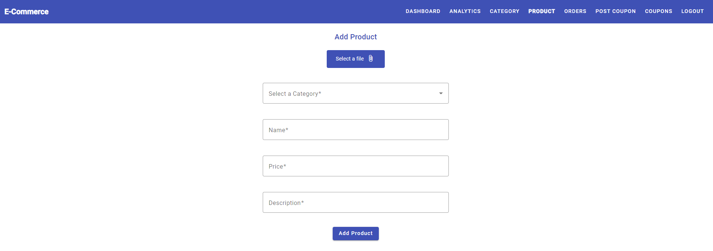

# Welcome to E-Commerce Angular Project 🛍️

Welcome to the E-Commerce Angular project! This project aims to build a sleek and modern e-commerce platform using Angular. It's still under construction!

## 📜 Description

E-Commerce Angular Project is a full-fledged e-commerce solution designed to provide users with a seamless shopping experience. From product discovery to checkout, our goal is to create a user-friendly interface backed by robust functionality.

## 🚀 Features

- **ADMIN PORTAL**: Add, edit or delete products, categories and coupons. Manage orders and view analytics.
- **Product Listing**: Browse through a wide range of products.
- **Search & Filter**: Find products quickly using the search bar.
- **User Authentication**: In this Angular project, we utilize JSON Web Tokens (JWT) for secure authentication and authorization purposes.
- **Shopping Cart**: Add products to the cart and manage them before proceeding to checkout.
- **Checkout Process**: Smooth and intuitive checkout process.

## Libraries/Frameworks Used

- **Angular Material**: Utilized for UI components and theming across the application. This includes components like buttons, cards, forms, dialogs, and more.

## 🔒 JWT Token Implementation

### Authentication Flow

1. **User Authentication**: When a user logs in to our application, their credentials are validated against our backend authentication service.
2. **Token Generation**: Upon successful authentication, the server generates a JWT token containing user information and necessary claims.
3. **Token Issuance**: The generated JWT token is issued to the client-side application.
4. **Token Storage**: The client-side application stores the JWT token securely, typically in local storage or session storage.
5. **Token Transmission**: For subsequent requests to protected resources, the client includes the JWT token in the request headers.

### Token Verification

1. **Authorization Middleware**: Our backend services are equipped with middleware to verify the authenticity and integrity of incoming JWT tokens.
2. **Token Decoding**: Upon receiving a request with a JWT token, the server decodes the token to extract user information and validate its signature.
3. **Authorization Checks**: Based on the decoded token's claims, the server performs authorization checks to ensure that the user has appropriate permissions for the requested resource.

### Benefits of JWT Tokens

- **Stateless Authentication**: JWT tokens enable stateless authentication, eliminating the need to store session state on the server-side.
- **Scalability**: With stateless authentication, our application can easily scale horizontally since any server can validate JWT tokens without relying on centralized session management.
- **Security**: JWT tokens are digitally signed, ensuring data integrity and preventing tampering. Additionally, they can be encrypted for added security.

## 🧳 Short Trip through pages

Let's take a quick tour of my site's key features:

### 1. Dashboard

- Dashboard welcomes visitors with a clean and intuitive interface.
- All placed products can be showcased here. User can search through all product by product name.

### 2. Product Details

- By clicking on a product, user can view detailed information, including descriptions, QA and customer reviews.
- Add items to your wishlist directly from this page.

### 3. Checkout Process

- User can use discount coupon.

- Place order button to proceed forward.

- Proceed to checkout seamlessly with our streamlined process.

### 4. Order details

- User can see order details and traking number.

### 5. Admin Dashboard

- Admins can access the dashboard to manage products, orders, and view analytics.

- Place new product.

- View and process orders.

